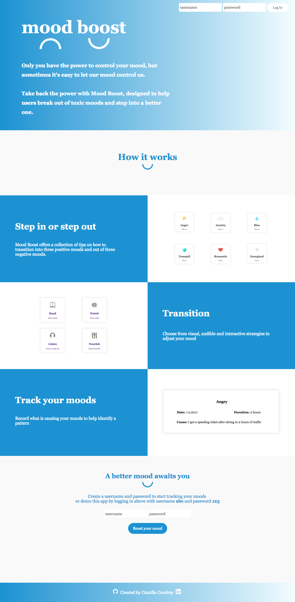
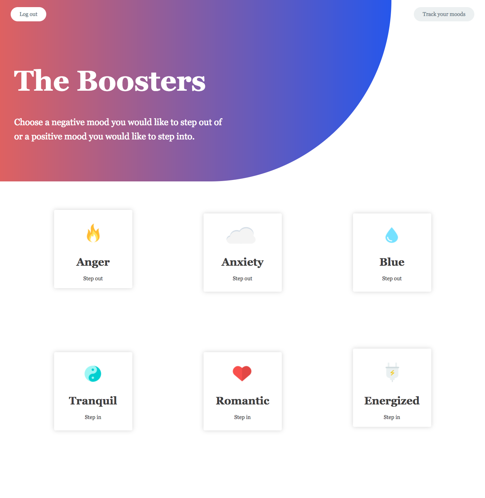
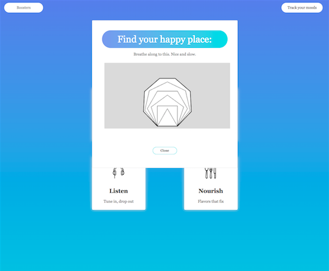

This application was created with React, Redux, Node.js, Express, Mongo, Javascript, HTML and CSS. 

Mood Boost was designed to give users a collection of strategies to help adjust their mood based on three common desirable moods (Tranquil, Energetic, Romantic) and three common undesirable moods (Anger, Anxiety, Sadness).

Each mood booster contains a inspiring quotes and tips in the Read modal, a helpful or condusive gif in with the Watch modal, a playlist from Spotify and Youtube in the Listen modal,and a list of foods known for enhancing a specific mood in the Nourish modal. 

Development Roadmap:

Moving forward, I would like to offer even more strategies on how to enhance the user's mood. I plan on spending more time researching ways to naturally adjust one's mood. I also plan on curating playlists myself for each mood. 

Screen Shots: 

This application is live at: https://diver-eugene-17360.netlify.com/

Technologies used:

Backend built using: Node.js/Express

Frontend build using: React/Redux

Database: MongoDB

Authentication: Passport.js

Client Side: Javascript, HTML, CSS